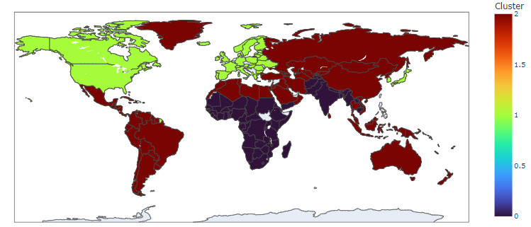
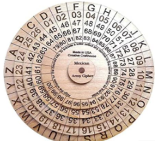

## Project Portfolio

---

### Supervised Learning 

Ames Iowa Housing
[Linear Regression Analysis](https://github.com/Joseph-J-Burton/Linear_Regression_project)

---
Customer Churn
[Tree Methods, Capstone project](https://github.com/Joseph-J-Burton/Supervised-Learning-Capstone)

---
[SVM project](https://github.com/Joseph-J-Burton/support-vector-machine)

---
[Random Forest classification](https://github.com/Joseph-J-Burton/random-forest-classification)

---
[NLP Text classification](https://github.com/Joseph-J-Burton/NLP-text-classification)

---

### Unsupervised Learning

Pecent of People with Cell Phones
[Kmeans Clustering](https://github.com/Joseph-J-Burton/Kmeans-Clustering)

---
[Project 2 Title](http://example.com/)

---

### Other Projects / Games

- [Caesar Cipher (message encoder/decoder)](https://github.com/Joseph-J-Burton/caesar-cipher) 

- [Hangman game](https://github.com/Joseph-J-Burton/Hangman-game) 

- [Rock Paper Scissors game](https://github.com/Joseph-J-Burton/rock-paper-scissors_game) 

- [Treasure Island game](https://github.com/Joseph-J-Burton/treasure_island) 

- [Coffee Machine](https://github.com/Joseph-J-Burton/oop-coffee-machine)
  
- [Tip Calculator](https://github.com/Joseph-J-Burton/tip-calculator) 

---

---

Thanks for viewing my Project Portfolio! I hope you have a great day!

<!-- Remove above message if you don't want -->
